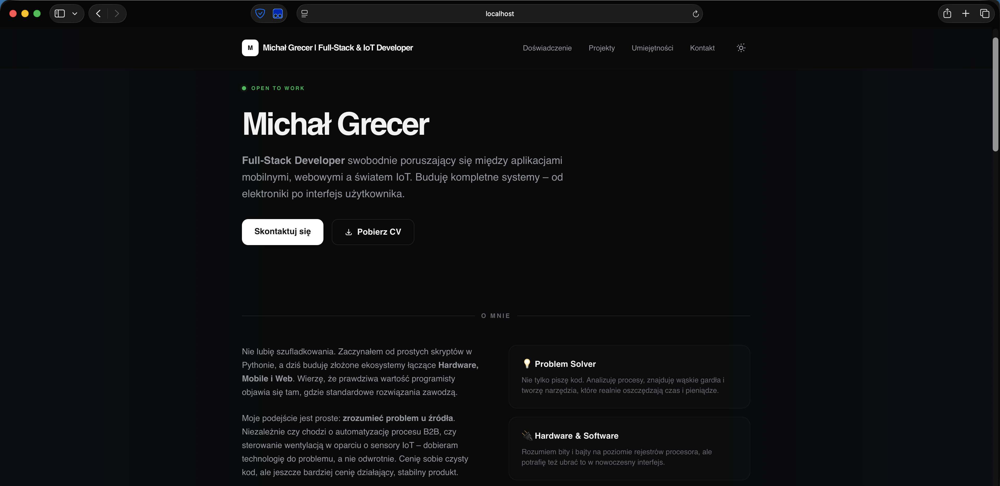
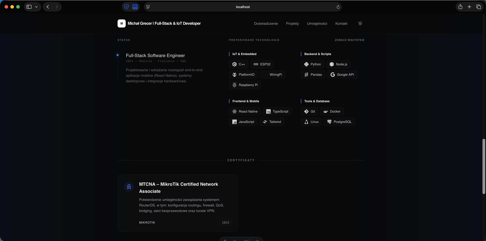
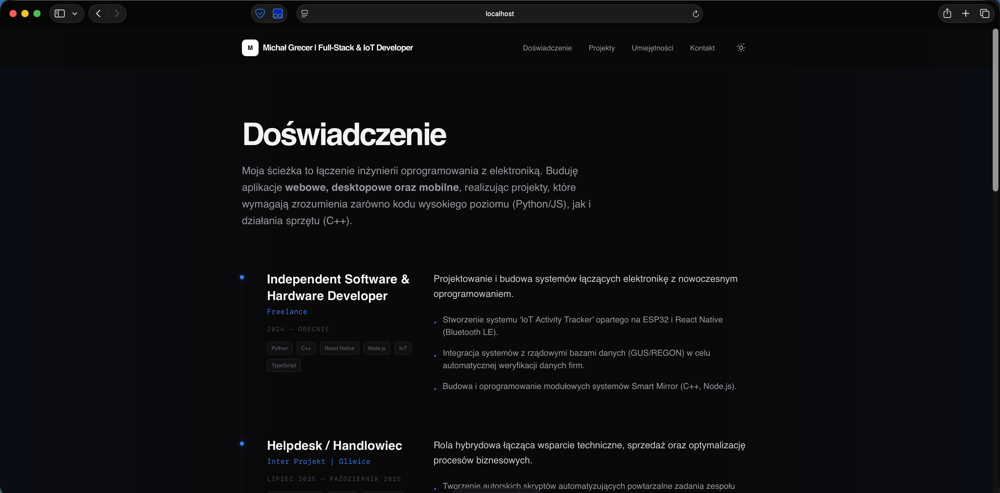
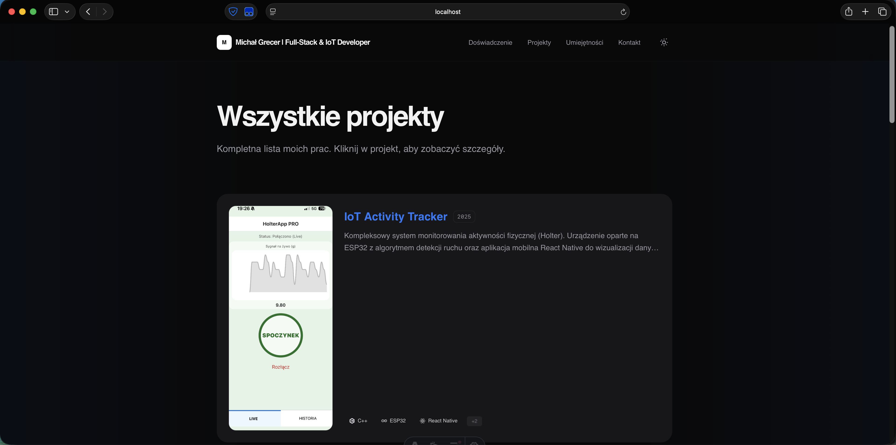
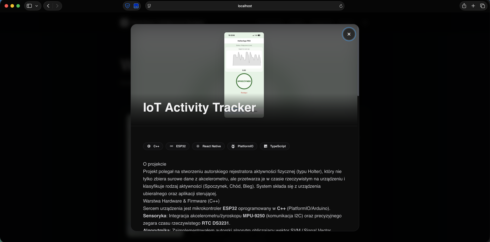
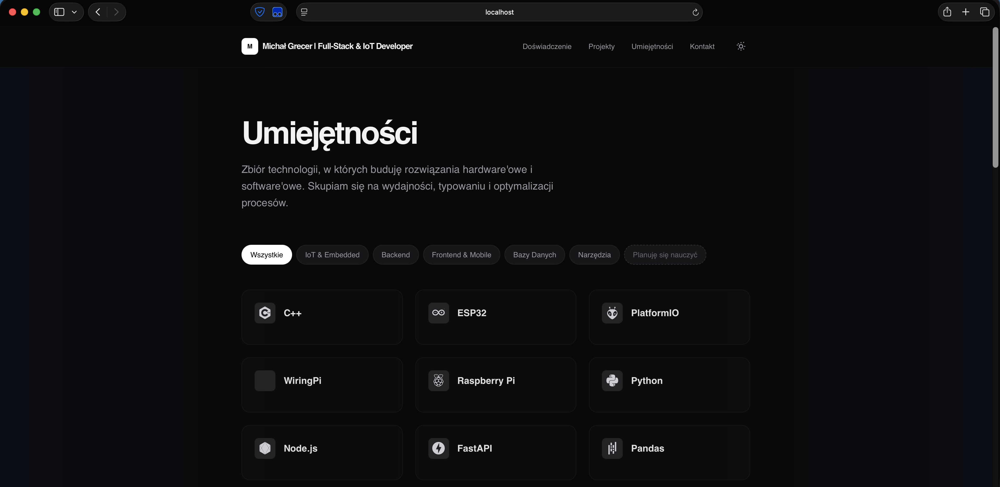
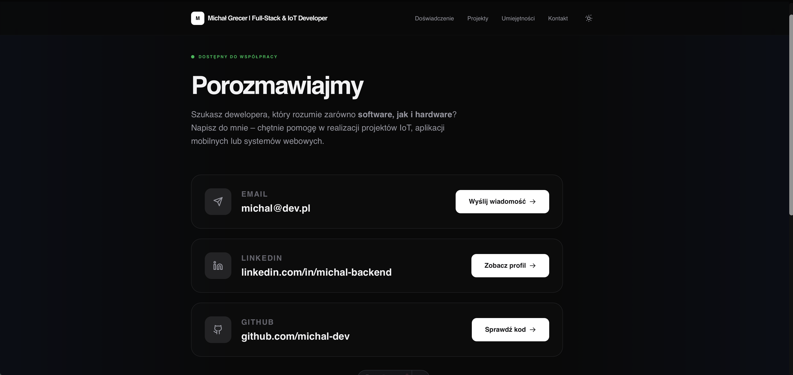

# Personal Portfolio Website

## Overview

This is a personal portfolio website engineered for high performance and deep mobile optimization. Built with **Astro**, it utilizes a static site generation approach to ensure near-zero client-side JavaScript delivery while maintaining a rich, interactive user experience.

The site is designed with a **Mobile-First** philosophy, specifically addressing common layout issues on iOS devices through advanced CSS and JavaScript techniques.









## Key Features

* **Astro Islands Architecture**: Leverages Astro for optimal performance and extremely fast loading times through pre-rendering.
* **iOS/Safari Optimization**: Deeply optimized for mobile browsers, featuring **Dynamic Viewport Height (dvh)** for stable layouts and **Safe Area** handling for device notches.
* **Centralized Tech Mapping**: A custom-built `techMap` system that manages technology icons (SVG/DevIcons) and brand colors from a single data source.
* **Interactive Modal System**: Custom project details view built with the HTML `<dialog>` element, including background scroll locking and smooth transitions.
* **Dynamic Image Gallery**: Interactive project galleries with loader states and responsive image handling.
* **Dark Mode Support**: Seamless integration of light and dark themes with fluid color transitions via Tailwind CSS.

## Technologies Used

### Frontend Technologies

* **Framework**: [Astro](https://astro.build/) - For high-performance static site generation.
* **Styling**: [Tailwind CSS](https://tailwindcss.com/) - For modern, utility-first styling and glassmorphism effects.
* **Language**: [TypeScript](https://www.typescriptlang.org/) - For type-safe logic and data management.
* **Content**: [Markdown](https://daringfireball.net/projects/markdown/) - To manage project data and professional experience.

### Tools & Assets

* **DevIcons**: For industry-standard technology branding.
* **Zod**: For strict validation of project and experience data schemas.

## Getting Started

### Prerequisites

* **Node.js** (v18.0 or higher recommended)
* **npm** (Node Package Manager)

### Installation and Setup

1.  **Clone the repository**:
    ```bash
    git clone https://github.com/MichalGrecer/portfolio.git
    ```

2.  **Navigate to the project directory**:
    ```bash
    cd portfolio
    ```

3.  **Install dependencies**:
    ```bash
    npm install
    ```

4.  **Start the development server**:
    ```bash
    npm run dev
    ```

5.  **Build for production**:
    ```bash
    npm run build
    ```

